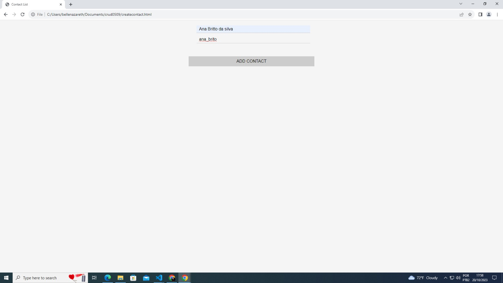

## Desafio Crud JS
O desafio é criar um CRUD de uma lista de contatos 
O resultado final é baseado em cada item do crud:.

- Create: o sistema precisa criar novos contato 
- Read: a lista de contatos deve estar disponível para consulta 
- Update: o sistema deverá atualizar dados do usuário 
- Delete: os contatos podem ser deletados da lista 

## Techs 
- JS
- HTML
- CSS

## Funcionamento da Página 
- Página inicial 

- Posibilidade de pesquisar o contato

- Adição de novo contato

- Psossibilidade de exclusão de contato

- Mensagem de alerta editar o usúario para um contato já existente 

- Tentar editar contato vazio

- Mensagem de alerta editar o usúario para um contato vazio

- Apresenta na tela contato editado

